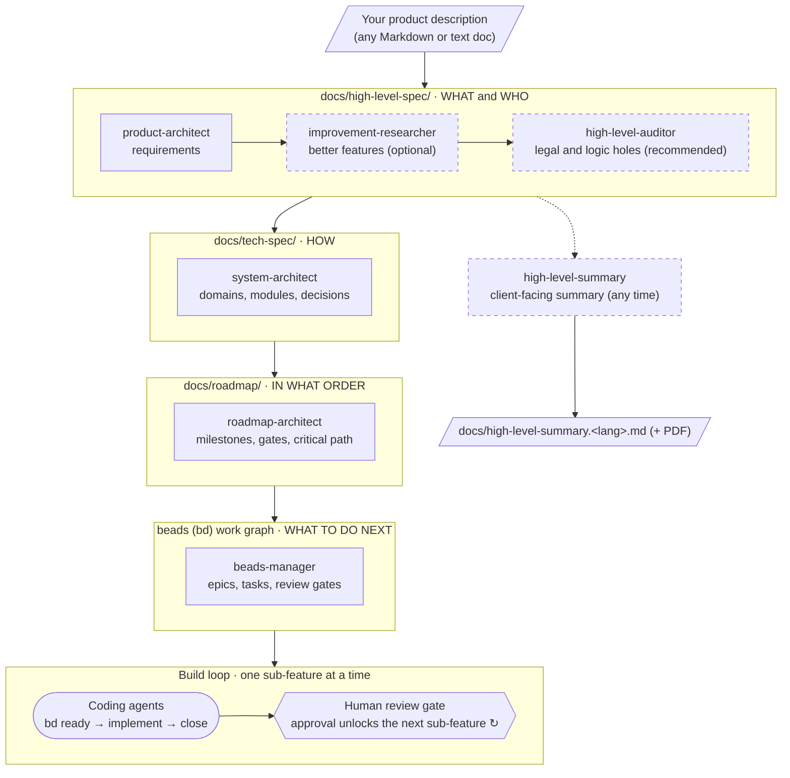

# AI Skills

AI coding agents are only as good as the expectations you give them. Hand an agent a vague idea and it fills the gaps with guesses. Hand it a clear, agreed definition of what to build and it has something concrete to deliver against.

These skills produce that definition in deliberate stages, and each stage refines the one before it:

1. A rough product idea becomes structured requirements.
2. The requirements are stress-tested for gaps and legal risk.
3. They're turned into a technical design.
4. The design is sequenced into a roadmap.
5. The roadmap is broken into small tasks that agents can pick up one reviewable chunk at a time.

Every stage leaves behind plain documentation that you can read, edit and version alongside your code.

You stay in the loop throughout. The skills do the analysis, surface the open questions and lay out the options with a recommendation. They never make a product or technical decision on your behalf. By the time an agent writes code, every task traces back to a requirement you approved and a decision you made.

Works with Claude Code, Codex, Cursor, GitHub Copilot, Gemini CLI and other agents that support skills. See [Compatibility](#compatibility).

> **v0.1.0: early and still evolving.** The pipeline runs end to end, but it hasn't been formally evaluated yet. See [Project status](#project-status).

## Contents

- [Skills](#skills)
  - [Spec pipeline](#spec-pipeline)
- [Installing](#installing)
  - [Pull a single skill without cloning](#pull-a-single-skill-without-cloning)
  - [Install all skills](#install-all-skills)
- [Using the skills](#using-the-skills)
- [Skill details](#skill-details)
- [Compatibility](#compatibility)
- [ID cheat sheet](#id-cheat-sheet)
- [Project status](#project-status)
- [License](#license)

## Skills

### Spec pipeline

This pipeline takes you from a product idea to agent-ready tasks. Each skill owns one stage and reads what the earlier stages produced. Whenever there's a real choice (a framework, a milestone boundary, a scope change), the skill stops and asks you. A separate summary skill turns the spec into a client-facing document at any point.



Each box is a skill, and each group is the folder that skill writes to. Dashed boxes are optional: you can go straight from `product-architect` to `system-architect`. You can run `high-level-summary` whenever the high-level spec exists, for example to share progress with a client. You can stop at any point. The high-level spec is useful on its own, and so is the tech spec.

| Skill | What it does | Reads | Writes |
|---|---|---|---|
| [`product-architect`](product-architect/SKILL.md) | Breaks a product description into non-technical requirements: domains, features, workflows, actors, data concepts and constraints. | Your product doc | `docs/high-level-spec/` |
| [`improvement-researcher`](improvement-researcher/SKILL.md) | Researches comparable products and proposes improvements (missing companion features, friction, retention, differentiation). | High-level spec | `docs/high-level-spec/improvements/` + accepted changes |
| [`high-level-auditor`](high-level-auditor/SKILL.md) | Reviews the spec adversarially for legal/compliance exposure and logic holes before anything gets built. | High-level spec | `docs/high-level-spec/audit/` + fixes |
| [`system-architect`](system-architect/SKILL.md) | Turns requirements into a technical spec: tech domains, modules and sub-modules, plus contracts and cross-cutting concerns. | High-level spec, your repo | `docs/tech-spec/` |
| [`roadmap-architect`](roadmap-architect/SKILL.md) | Sequences the tech spec into milestones, with a dependency graph, a critical path and gates. | High-level + tech spec | `docs/roadmap/` |
| [`beads-manager`](beads-manager/SKILL.md) | Loads the roadmap into a [beads](https://github.com/steveyegge/beads) issue graph, chained so agents work on one reviewable chunk at a time. | All three specs | `bd` database + `docs/beads/runs/` |
| [`high-level-summary`](high-level-summary/SKILL.md) | Writes a plain-language summary for clients and stakeholders, organized around user journeys. Can be run at any time. | High-level spec (incl. audit and improvements) | `docs/high-level-summary.<lang>.md` (+ PDF) |

## Installing

Every agent looks for skills in its own folder, either per project or globally for your user:

| Agent | Project folder | Global folder |
|---|---|---|
| Claude Code | `.claude/skills/` | `~/.claude/skills/` |
| Codex | `.agents/skills/` | `~/.codex/skills/` |
| Cursor | `.agents/skills/` | `~/.cursor/skills/` |
| GitHub Copilot | `.agents/skills/` | `~/.copilot/skills/` |
| Gemini CLI | `.agents/skills/` | `~/.gemini/skills/` |
| OpenCode | `.agents/skills/` | `~/.config/opencode/skills/` |

These are the paths the [skills CLI](https://github.com/vercel-labs/skills) installs to. For any other agent, check its docs for where it loads skills from.

### Pull a single skill without cloning

**Option 1: the `skills` CLI (recommended).** It knows each agent's folder and can install into several agents at once:

```bash
# See what's in the repo
npx skills add mifkata/ai-skills --list

# Install one skill; you'll be asked which agents to install it for
npx skills add mifkata/ai-skills --skill product-architect

# Or name the agents, and add -g to install globally instead of into the current project
npx skills add mifkata/ai-skills --skill product-architect -a claude-code -a codex -g
```

- **Agent IDs:** `claude-code`, `codex`, `cursor`, `github-copilot`, `gemini-cli`, `opencode`, and more (see `npx skills --help`).
- **Project installs:**
  - Files land in `.agents/skills/`.
  - Agents that use their own folder, such as Claude Code, get a symlink.
  - A `skills-lock.json` records what was installed.
- **Updating:** `npx skills update`.

**Option 2: `curl` (no tooling).** Each skill is currently a single `SKILL.md` file. Set `DEST` to your agent's folder from the table above:

```bash
DEST=~/.claude/skills          # or .agents/skills, ~/.codex/skills, ...
SKILL=product-architect
mkdir -p "$DEST/$SKILL"
curl -fsSL "https://raw.githubusercontent.com/mifkata/ai-skills/main/$SKILL/SKILL.md" \
  -o "$DEST/$SKILL/SKILL.md"
```

**Option 3: tarball (copies the whole skill folder).** Use this if a skill ever gains extra files such as scripts or references. It needs only `curl` and `tar`:

```bash
DEST=~/.claude/skills
SKILL=product-architect
mkdir -p "$DEST"
curl -fsSL https://github.com/mifkata/ai-skills/archive/refs/heads/main.tar.gz \
  | tar -xz -C "$DEST" --strip-components=1 "ai-skills-main/$SKILL"
```

For options 2 and 3:

- **Updating:** run the same command again. It overwrites the local copy.
- **Pinning a version:** in option 2, replace `main` with a tag or commit SHA.
- If your agent is already running and the skill doesn't show up, restart the session.

### Install all skills

```bash
npx skills add mifkata/ai-skills --skill '*'
```

Or without tooling:

```bash
DEST=~/.claude/skills
for SKILL in product-architect improvement-researcher high-level-auditor \
             high-level-summary system-architect roadmap-architect beads-manager; do
  mkdir -p "$DEST/$SKILL"
  curl -fsSL "https://raw.githubusercontent.com/mifkata/ai-skills/main/$SKILL/SKILL.md" \
    -o "$DEST/$SKILL/SKILL.md"
done
```

If you'd rather track updates with git, clone the repo and symlink the folders you want:

```bash
git clone https://github.com/mifkata/ai-skills.git ~/src/ai-skills
ln -s ~/src/ai-skills/product-architect ~/.claude/skills/product-architect
```

## Using the skills

### Running a skill

How you start a skill depends on your agent:

- **As a slash command:** many agents expose each skill as `/<skill-name>`, for example `/product-architect product.md`.
- **By name:** in any agent, ask for it directly, for example *"Use the product-architect skill on product.md"*.

The pipeline skills are meant to run only when you ask for them. Some agents may also start a skill on their own when a request matches its description; see [Compatibility](#compatibility).

### A typical first run

1. **Write down the product.** A Markdown file describing what you want to build, for example `product.md`. It can be rough.
2. **Run `product-architect` on `product.md`.** Answer its questions about domains, roles, scope and any behavior the doc leaves implicit. You get `docs/high-level-spec/`.
3. **Run `improvement-researcher`** *(optional)*. Tell it which competitors to look at and which goals matter. Accept, edit, park or reject each proposal.
4. **Run `high-level-auditor`** *(recommended)*. Confirm your markets and jurisdiction, then choose a fix for each finding or accept the risk.
5. **Run `system-architect`.** Choose among the proposed stack, architecture and data options, layer by layer. You get `docs/tech-spec/`.
6. **Run `roadmap-architect`.** Choose a sequencing strategy (e.g. walking skeleton, risk-first) and approve the milestones. You get `docs/roadmap/`.
7. **Run `beads-manager`.** Approve the generated plan. It creates the epics, tasks and review gates in `bd`.
8. **Let agents build.** Agents pull work with `bd ready --exclude-type epic,milestone --json`. After each sub-feature, a human review gate has to be resolved before the next one unlocks.

At any point after step 2, run **`high-level-summary`** to get a readable document you can send to a client or stakeholder. Re-run it after the spec changes.

### Tips

- **Narrow the scope.** Most skills take an optional scope argument so you can work on one area at a time. The examples use slash-command syntax; in other agents, include the same arguments in your request.
  ```
  /system-architect MOB
  /high-level-auditor PW-F03 PW-F04
  /roadmap-architect SRV-M02
  /beads-manager MS-01
  /improvement-researcher PW limit:3
  /high-level-summary lang:en length:brief pdf
  ```
- **Preview before writing.** If your agent has a plan mode (Shift+Tab in Claude Code), run the skill in it to see the complete set of files it would write. Nothing is written until you approve the plan.
- **Re-run freely.** Each skill detects existing output and switches to *update mode*. IDs and filenames never change, removed items are marked `withdrawn` rather than deleted, and downstream items affected by a change are flagged `stale`. After editing your product doc, re-run the chain from the top.
- **Everything is traceable.** Every generated item records its source: a section of your doc, a question you answered, a decision you accepted, or a file in the repo. If a skill can't trace something, it asks you a question instead of guessing.
- **Unanswered questions are saved.** Questions you skip are written as `status: open` question files, and anything blocked by them stays in `draft` until you answer.

### What ends up in your project

```
docs/
  high-level-spec/              product-architect (+ audit/ and improvements/)
  high-level-summary.<lang>.md  high-level-summary (+ .pdf)
  tech-spec/                    system-architect
  roadmap/                      roadmap-architect
  beads/runs/                   beads-manager run logs
```

Each folder has a generated `index.md` that lists every item with its status, which makes it the best place to start reading.

## Skill details

### product-architect

> Defines **what** gets built and **for whom**, never **how**.

- **Arguments:** `<path-to-product-doc>`
- **Output:** one file per domain, feature, actor, data concept, cross-domain flow, constraint and open question.
- **Behavior:**
  - Starts from baseline domains (public web, admin, mobile, server, data) and adds others such as billing, notifications or compliance when your doc mentions them.
  - Asks you to confirm which domains are in scope.
  - Never fills in unstated behavior. Roles and permissions, account lifecycle, data retention, pricing and moderation all turn into questions.
  - Keeps technology, APIs, schemas and UI out of the spec.

### improvement-researcher

> Finds what works but is clunky, incomplete, or leaves value on the table.

- **Arguments:** `[domain or feature IDs] [limit:N]`. The default limit is 5 proposals per domain.
- **Output:** `improvements/landscape.md` (comparable products, with sources) and one `IMP-nn` proposal file each.
- **Behavior:**
  - Every proposal needs evidence: a gap in your spec, a named competitor, an established pattern, or something you told it.
  - It never invents statistics.
  - Proposals that would change your stated scope are flagged and shown first.
  - Rejected ideas are not proposed again unless the underlying spec changes.
- **Next:** if you accept anything, re-run `high-level-auditor`.

### high-level-auditor

> Assumes every workflow fails, every actor misbehaves, and every regulation applies until shown otherwise.

- **Arguments:** `[domain or feature IDs]`
- **Output:** `audit/facts.md` (jurisdiction and applicability facts) and one `AUD-nn` finding file each, rated `blocker`, `major`, `minor` or `note`.
- **Checks:**
  - **Legal and compliance:** personal data, consumer rights, minors, accessibility, payments, user-generated content, AI disclosure, sector rules.
  - **Logic and edge cases:** lifecycle gaps, concurrency, authority changes, time zones, money edge cases, identity, abuse, contradictions.
- **Behavior:**
  - Legal claims are checked on the web and cite a source.
  - Obligations whose jurisdiction and applicability are confirmed are added to the spec as constraints. Any change to features or scope needs your confirmation.
- ⚠️ **This is not legal advice.** Serious legal findings are marked `counsel: recommended`.

### high-level-summary

> Turns the spec into something a client actually wants to read.

- **Arguments:** `[lang:en|bg] [length:brief|short|full] [pdf]`
  - Language: asked for if not given.
  - Length: defaults to `short` (3–5 pages). `brief` fits on one page; `full` has no cap.
  - `pdf`: also exports a PDF via `pandoc`, if it's installed.
- **Output:** `docs/high-level-summary.<lang>.md`, structured as:
  - a one-line proposition and who the product is for
  - user journeys told as short stories, grouped by role
  - what's included and what's not, plus ground rules and compliance commitments
  - risks that were considered and how they're handled
  - improvements added after market research
  - a glossary
- **Behavior:**
  - Read-only on the spec, and never claims anything the spec doesn't say.
  - Hides IDs and technical terms from readers. Each paragraph still traces back to spec IDs through hidden HTML comments.
  - Leaves out drafts, withdrawn items and open questions, and asks you how to handle serious audit findings that are still open.
  - Shows you an outline to approve before writing.
  - If you've edited the generated file by hand, it asks before overwriting it.

### system-architect

> Defines **how**, structurally. It doesn't write code.

- **Arguments:** `[domain codes or feature IDs]`
- **Output:**
  - Tech domains, each split into modules and then sub-modules.
  - Shared contracts (`CT`) and cross-cutting concerns (`CC`, such as auth, logging or i18n).
  - Decision files (`DEC`) and technical questions (`TQ`).
- **Behavior:**
  - Works in layers: foundation (stack, hosting, data stores), then cross-cutting concerns and contracts, then modules, then sub-modules.
  - Every technical choice becomes a `DEC` file that lists options, pros, cons and a recommendation, and **you** pick. That includes your existing repo stack, which is treated as an option rather than a default.
  - Sub-modules are sized so a single agent can implement and verify one in a single task.
  - Checks coverage: every final feature must be implemented somewhere.

### roadmap-architect

> Sequences the build and never reorders silently.

- **Arguments:** `[domain codes, module IDs or feature IDs]`
- **Output:**
  - Milestones (`MS`), gates (`GT`: convergence, external or decision), spikes (`SPK`) and tracks (`TR`).
  - Roadmap decisions (`RDEC`) and questions (`RQ`).
  - Generated `roadmap.md` and `graph.md` (dependency graph and critical path).
- **Behavior:**
  - Asks what drives priority (value, risk, dependencies or a demo date), then proposes 2–3 sequencing strategies for you to choose from.
  - Dates and effort estimates appear only if you provide capacity and ask for them.

### beads-manager

> Turns the roadmap into a queue that agents can safely work from.

- **Arguments:** `[milestone IDs, domain codes or module IDs]`
- **Output:**
  - A [beads](https://github.com/steveyegge/beads) graph with four levels: domain epic, feature epic, sub-feature epic, then tasks/stories/chores/spikes/bugs.
  - A run log in `docs/beads/runs/`.
- **Behavior:**
  - Sub-feature epics form a single serial chain with a **human review gate** between each one, so `bd ready` only ever returns work from one sub-feature at a time.
  - Idempotent: it looks up existing beads before creating anything, never duplicates or deletes, and never changes in-progress or closed work without asking.
  - Shows you the full command script before running it.

## Compatibility

The skills were written and tested in Claude Code and use a few of its extensions. This is how those behave in other agents:

| Feature | In Claude Code | In other agents |
|---|---|---|
| `disable-model-invocation: true` | The skill runs only when you call it. | May be ignored, so the agent could start a skill on its own when a request matches. Each description ends with "Manual invocation only" to discourage this. |
| `argument-hint` / `$ARGUMENTS` | Autocomplete hint; your arguments are inserted into the instructions. | Put the arguments in your request. With no arguments, a skill falls back to its default scope (everything) or asks you. |
| `allowed-tools` | Pre-approves the listed tools (uses Claude Code tool names). | Experimental in the spec and may be ignored; you'll get your agent's normal permission prompts. |
| Question tool (`AskUserQuestion`) | Multiple-choice questions with a recommended option. | The agent asks the same questions in chat. |
| Plan mode (`ExitPlanMode`) | Full preview of every file before anything is written. | Used only if your agent has an equivalent; otherwise the skill runs in its normal mode. |
| Subagents | `system-architect` can research domains in parallel. | Research runs sequentially. |

**Headless and CI runs.** When a skill has no way to ask you anything, it switches to its non-interactive mode:

- Most skills save their questions as `status: open` files and leave anything those questions block in `draft`.
- `roadmap-architect` and `beads-manager` stop and report instead of writing.
- `high-level-summary` needs `lang:` passed as an argument, and leaves out serious findings that are still open.

**What the agent needs access to:**

- **All skills:** reading and writing files in your project.
- **`improvement-researcher`, `high-level-auditor`, `system-architect`:** web search and fetch, to research competitors, regulations and library options.
- **`beads-manager`:**
  - [`bd`](https://github.com/steveyegge/beads) ≥ 1.3, installed with `brew install beads` or `npm i -g @beads/bd`.
  - `jq`.
  - Permission to run both.
- **`high-level-summary` with `pdf`:** [`pandoc`](https://pandoc.org) (optional; without it, the PDF step is skipped).

## ID cheat sheet

<details>
<summary>What all those IDs in the generated files mean</summary>

| ID | Meaning | Created by |
|---|---|---|
| `A-nn` | Actor (a user role) | product-architect |
| `<CODE>-Fnn` | Feature in a domain, e.g. `PW-F03` | product-architect |
| `<CODE>-Fnn-Wn` | Workflow inside a feature | product-architect |
| `DAT-Dnn` / `<CODE>-Dnn` | Data concept | product-architect |
| `X-nn` | Cross-domain flow | product-architect |
| `G-Knn` / `<CODE>-Knn` | Global / domain constraint | product-architect, high-level-auditor |
| `Q-<CODE>-nn` | Product question | product-architect, auditor, researcher |
| `IMP-nn` | Improvement proposal | improvement-researcher |
| `AUD-nn` | Audit finding | high-level-auditor |
| `<CODE>-Mnn` / `<CODE>-Mnn-Snn` | Module / sub-module | system-architect |
| `CC-nn` / `CT-nn` | Cross-cutting concern / contract | system-architect |
| `DEC-…` / `TQ-…` | Technical decision / question | system-architect |
| `MS-nn` / `GT-nn` / `SPK-nn` / `TR-nn` | Milestone / gate / spike / track | roadmap-architect |
| `RDEC-nn` / `RQ-nn` | Roadmap decision / question | roadmap-architect |

Common domain codes: `PW` public web, `ADM` admin, `MOB` mobile, `SRV` server, `DAT` data, plus any the skills discover, such as `BIL` billing, `NOT` notifications, `PLT` platform or `SHR` shared.

</details>

## Project status

**Version 0.1.0.** The pipeline works end to end, but it's still under active development. Skill instructions, file layouts and ID formats may change between versions.

**What's missing: proof that it works well.** There are no evaluations or grading yet. Today, the quality of the output rests on the design of the skills and on your review at each step, not on measured results. Future versions should add evaluations that show:

- **How reliable each skill is across models and agents.** The same product brief would run through different models, and the results would be compared for coverage, consistency and traceability.
- **How good the output is, as judged independently.** Each stage's output would be scored against explicit rubrics by independent judges, both other models and human reviewers, instead of relying on the author's impression.

**Why that isn't done yet.** This pipeline is hard to evaluate:

- A single run produces dozens of interlinked documents.
- Those documents are shaped by the answers a human gave along the way.
- There's rarely one correct result to compare against.

Meaningful evaluations need realistic product briefs, stable rubrics for every stage, and a way to replay human decisions. It makes more sense to build that once the pipeline itself has settled.

Until then, treat what the skills produce as a strong first draft, and review it with the same care you'd give a colleague's work.

## License

[MIT](LICENSE) © 2026 Andriyan Ivanov.

Each skill also declares `license: MIT` in its frontmatter, so the license travels with the file when you install a single skill on its own.
